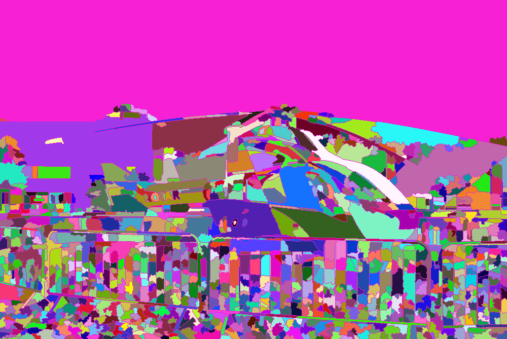

# Introduction

This repository provides an implementation of the watershed algorithm from Pierre Soille which is based on the proposed algorithm in [1].
It is implemented with two small modifications which focus on reducing oversegmentation.
In contrast to the OpenCV implementation of the watershed algorithm, this algorithm does not require seedpoints.
Instead it starts new segments at local minimas.
The algorithm can be controlled by the parameters described in the following sections.





## Preflod

The preflood initializes the flood level of the algorithem with an initial value.
Due to this value the flood has already reached an level at which small lakes are flooded and fused to larger lakes.
The higher the preeflood the larger the initial lakes and the less the number of produced segments.


## Flood Increment

The flood increment defines how much the flood increases with every iteration.
Larger values leed to larger segments and less detailed segment borders.


## Minimal Segment Size
The minimal segement size allows only segments with a predefined minimal size.
If the algorithm detects a potential segment which is smaller than this size the segment will be removed from the segmentation.
At the next flood level the pixels of the removed segment will be processed again by fusing them with an existing segment (preferred) or by creating a new segment.


## Minimal Lake Depth

The minimal lake depth also reduces over segmentation.
It forces a new segment to have a minimal depth which is defined by this parameter.
The higher this value the less segments will be produced by the algorithm.


# Dependencies

The watershed algorithm has OpenCV as its only dependency in order to load and represent images.


# Building and Executing the Example

In oder to build the example program execute the following steps on the command line:
```
mkdir build
cd build
cmake -DCMAKE_BUILD_TYPE=Release ..
make -j
```

You can execute the example program with:
```
./watershed -i ../example_image.png  -o ../example_segmentation.png 
```

# Literature

1. Soille, P. (2013). Morphologische Bildverarbeitung: Grundlagen, Methoden, Anwendung. Springer-Verlag.
